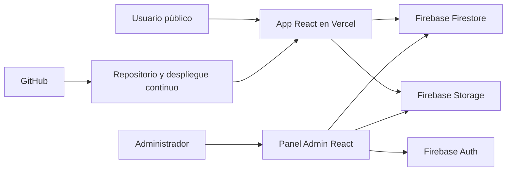
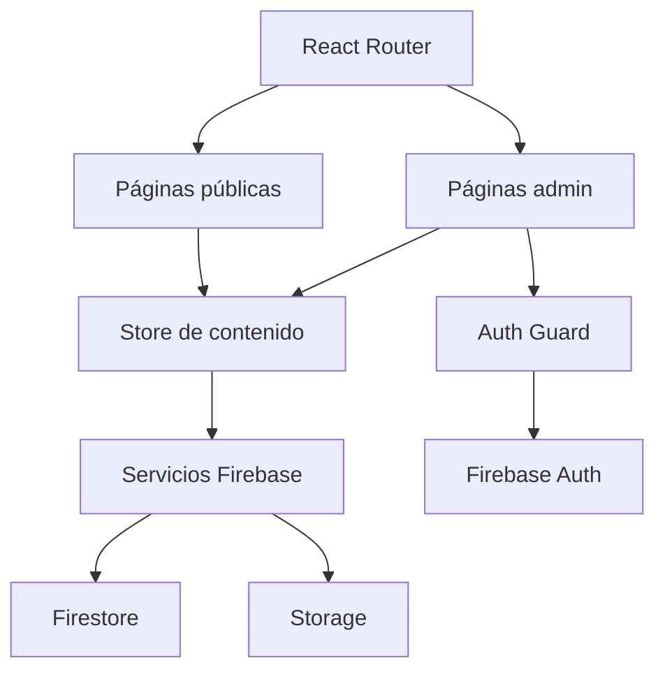
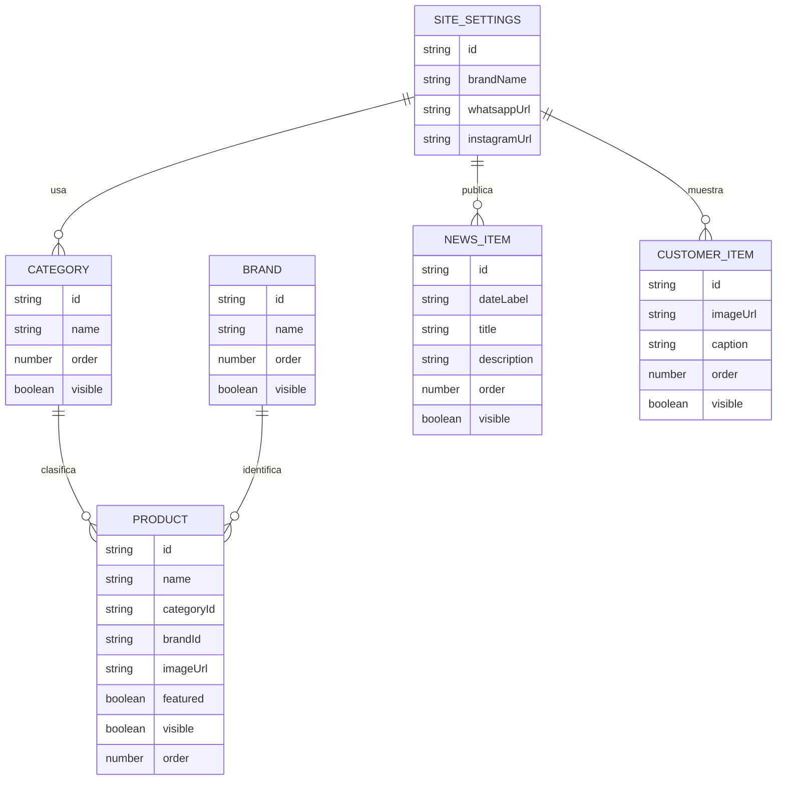

## 1. Diseño De Arquitectura


## 2. Descripción Tecnológica
- Frontend: `React 18` + `TypeScript` + `Vite`
- Routing: `react-router-dom`
- Estado global: `zustand`
- Estilos: CSS modular propio y variables globales; sin alterar la estética original del boceto
- Backend gestionado: `Firebase Auth`, `Firestore`, `Firebase Storage`
- Hosting: `Vercel`
- Control de versiones: `GitHub`
- Testing: `Vitest` + `Testing Library`

## 3. Definición De Rutas
| Ruta | Propósito |
|------|-----------|
| `/` | Landing pública que replica fielmente `Home.dc.html` |
| `/catalogo` | Catálogo completo con filtros por categoría |
| `/admin/login` | Acceso autenticado para administradores |
| `/admin` | Dashboard principal del panel |
| `/admin/productos` | Gestión de productos |
| `/admin/contenido` | Gestión de home, noticias, clientes y datos de contacto |
| `/admin/configuracion` | Configuración general de branding y enlaces |

## 4. Definiciones De API Y Servicios
La solución no requiere un backend Node dedicado en esta etapa. El frontend consume Firebase directamente con reglas de seguridad y operaciones separadas por servicios.

```ts
export type SiteSettings = {
  brandName: string
  whatsappUrl: string
  instagramUrl: string
  locationText: string
  legalText: string
  heroTitle: string
  heroHighlight: string
  heroDescription: string
  heroPrimaryCtaLabel: string
  heroPrimaryCtaHref: string
  heroSecondaryCtaLabel: string
  heroSecondaryCtaHref: string
  officialBadgeText: string
}

export type Category = {
  id: string
  name: string
  order: number
  visible: boolean
}

export type Brand = {
  id: string
  name: string
  order: number
  visible: boolean
}

export type Product = {
  id: string
  name: string
  categoryId: string
  categoryName: string
  brandId?: string
  brandName?: string
  imageUrl: string
  featured: boolean
  visible: boolean
  order: number
}

export type NewsItem = {
  id: string
  dateLabel: string
  title: string
  description: string
  order: number
  visible: boolean
}

export type CustomerItem = {
  id: string
  imageUrl: string
  caption: string
  order: number
  visible: boolean
}
```

## 5. Arquitectura De Aplicación


## 6. Modelo De Datos
### 6.1 Definición Del Modelo


### 6.2 Estructura En Firebase
```text
collections/
  siteSettings/{singleton}
  categories/{categoryId}
  brands/{brandId}
  products/{productId}
  news/{newsId}
  customers/{customerId}

storage/
  branding/
  products/
  customers/
  news/
```

## 7. Decisiones Técnicas Clave
- Se migra el HTML existente a componentes React separando estructura visual y fuente de datos.
- Se preserva el estilo visual actual usando CSS derivado del boceto, evitando rediseños.
- Se reemplaza `localStorage` por Firebase para lograr autoadministración real y persistencia remota.
- El panel admin se protege con Firebase Auth y rutas privadas.
- Las imágenes se almacenan en Firebase Storage y las referencias quedan en Firestore.
- El despliegue en Vercel usa variables `VITE_FIREBASE_*` configuradas desde el panel del proyecto.

## 8. Estrategia De Implementación
1. Inicializar proyecto `react-ts` con Vite y estructura modular.
2. Copiar assets existentes y reconstruir Home, Catálogo y Admin como páginas React.
3. Crear capa de servicios Firebase y store global para contenido.
4. Implementar autenticación admin y CRUD de contenido.
5. Configurar `vercel.json`, `.env.example` y scripts de validación.
6. Agregar tests de render y validaciones básicas de datos.

## 9. Riesgos Y Controles
- Riesgo visual: desvíos de spacing o tipografía durante la migración.
  Control: replicar estructura sección por sección usando el HTML actual como referencia exacta.
- Riesgo de contenido incompleto: el admin debe cubrir más que productos.
  Control: modelar desde el inicio `siteSettings`, `news` y `customers`.
- Riesgo de subida de imágenes: inconsistencias entre Storage y Firestore.
  Control: encapsular uploads y persistencia en servicios únicos reutilizables.
- Riesgo de despliegue: variables ausentes en Vercel.
  Control: documentar `.env.example` y validar configuración al iniciar la app.
