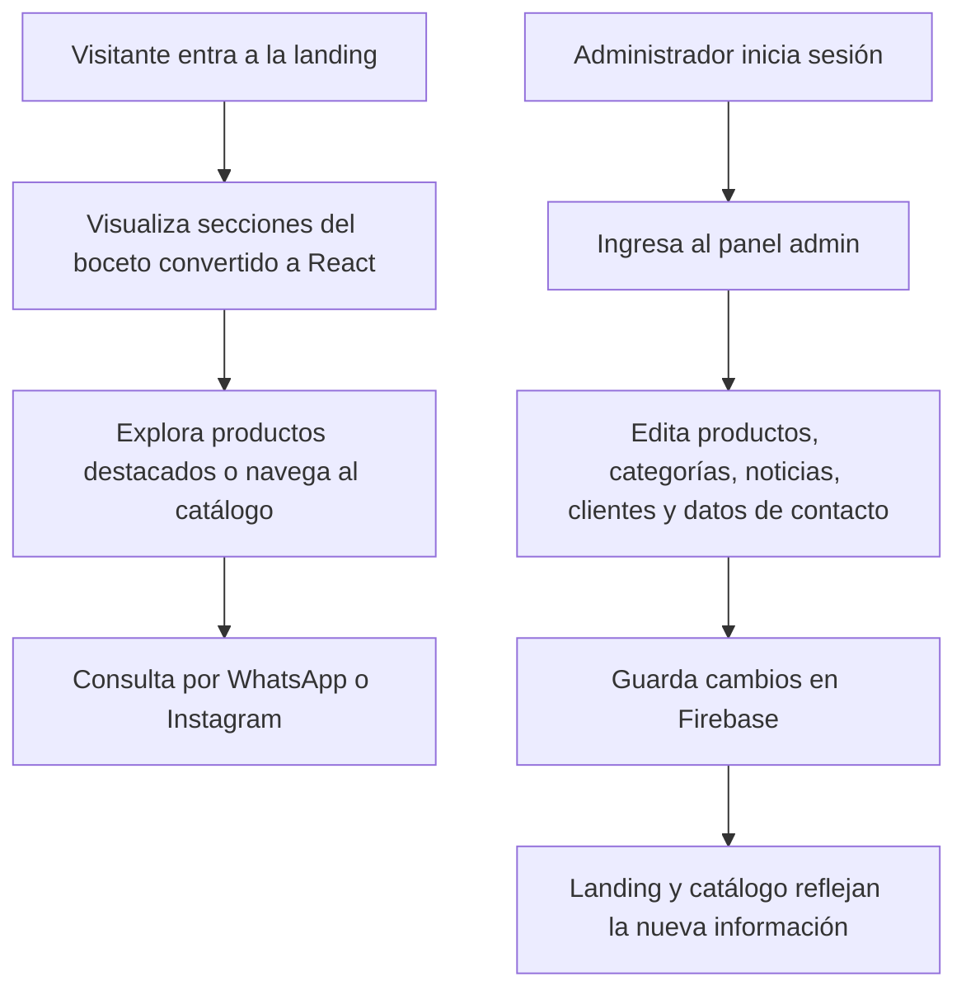

## 1. Descripción General Del Producto
Migración del boceto HTML de Bicicletería Laprida hacia una aplicación React totalmente funcional, con panel administrador y contenido gestionado desde Firebase, manteniendo intacta la estética actual del diseño.
- El producto resuelve la necesidad de publicar una landing comercial editable sin depender de cambios manuales en HTML o código por parte del cliente.
- El valor principal está en combinar una imagen visual ya aprobada con una arquitectura moderna, autoadministrable y lista para publicar en Vercel.

## 2. Funcionalidades Principales
### 2.1 Roles De Usuario
| Rol | Método de acceso | Permisos principales |
|------|------------------|----------------------|
| Visitante | Acceso público | Ver landing, catálogo, noticias, clientes y enlaces de contacto |
| Administrador | Login seguro con Firebase Auth | Editar todo el contenido visible, cargar imágenes, ordenar secciones y publicar cambios |

### 2.2 Módulos Funcionales
1. **Landing pública**: hero, navegación, franja promocional, categorías, teaser de catálogo, noticias, clientes, contacto y CTA a WhatsApp.
2. **Catálogo público**: filtros por categoría, listado de productos y CTA de consulta por WhatsApp.
3. **Panel administrador**: autenticación, gestión de productos, categorías, marcas, noticias, clientes, datos de contacto y configuración de home.
4. **Gestión de medios**: subida y selección de imágenes para productos, clientes, logos y piezas visibles en la landing.

### 2.3 Detalle De Páginas
| Página | Módulo | Descripción funcional |
|--------|--------|-----------------------|
| Landing | Navegación | Mantiene exactamente la composición visual del boceto y permite anclas a catálogo, noticias, clientes y contacto |
| Landing | Hero principal | Muestra titular, subtítulo, sello KTM, botones de catálogo y WhatsApp configurables desde admin |
| Landing | Categorías | Lista categorías visibles cargadas desde Firebase respetando el formato del boceto |
| Landing | Catálogo teaser | Muestra productos destacados administrables, con imagen, categoría, nombre y CTA |
| Landing | Noticias | Publica bloques de novedades, cicloturismo y competencias cargados por el cliente |
| Landing | Clientes | Muestra testimoniales o fotos de clientes con texto editable e imágenes reales |
| Landing | Footer | Expone logo, ubicación, Instagram, WhatsApp y texto legal editable |
| Catálogo | Filtros | Permite cambiar de categoría sin salir de la página |
| Catálogo | Grilla | Muestra productos con imagen, nombre, categoría y consulta por WhatsApp |
| Admin | Acceso | Protege el panel con autenticación y sesión persistente |
| Admin | Gestión de productos | Alta, edición, baja, destacado, imagen, orden, categoría, marca y estado de publicación |
| Admin | Gestión de categorías y marcas | Alta, edición y baja con validaciones para evitar duplicados |
| Admin | Gestión de contenido | Edición de textos, noticias, CTA, clientes, datos de contacto y enlaces externos |
| Admin | Gestión de medios | Subida de archivos a Firebase Storage y vinculación a los módulos de contenido |

## 3. Proceso Principal
El visitante entra a la landing, recorre el contenido y puede pasar al catálogo o contactar por WhatsApp. El administrador inicia sesión, actualiza contenidos desde el panel y los cambios se reflejan en la landing pública sin tocar el diseño ni editar código.

## 4. Diseño De Interfaz
### 4.1 Estilo Visual
- Regla principal: conservar al 100% la identidad visual del boceto HTML aprobado.
- Paleta base: negro profundo, magenta vibrante, beige claro y blancos del layout actual.
- Tipografía: mantener `Anton` para títulos y `Archivo` para textos, botones y etiquetas.
- Botones: conservar bloques rectos, alto contraste, mayúsculas y el tratamiento actual del CTA principal.
- Composición: mantener grillas, márgenes, rotaciones leves, sello KTM, marquee y estructura editorial existente.
- Iconografía: mínima y funcional; priorizar texto y composición tal como en el boceto.

### 4.2 Resumen Visual Por Página
| Página | Módulo | Elementos de UI |
|--------|--------|-----------------|
| Landing | Hero | Titular gigante, sello circular, CTA dobles, centrado y fondos decorativos |
| Landing | Categorías | Tiras o celdas rígidas con texto en mayúsculas y separación marcada |
| Landing | Catálogo teaser | Cards con borde negro, imagen superior y botón magenta |
| Landing | Noticias | Bloques de alto contraste con acento magenta |
| Landing | Clientes | Grilla visual con fotos o placeholders reemplazables por contenido real |
| Catálogo | Filtros | Tabs rectangulares de alto contraste que no alteran la identidad visual |
| Catálogo | Productos | Grilla rígida, bordes fuertes, jerarquía simple y CTA directo |
| Admin | Panel | Interfaz funcional, clara y sobria, separada visualmente de la landing pública |

### 4.3 Responsividad
- Enfoque desktop-first, porque el boceto original está pensado en ancho grande y composición editorial.
- Adaptación mobile sin rediseñar la identidad: sólo reflujo de grillas, apilado de bloques y preservación tipográfica proporcional.
- Mantener jerarquía visual, contraste y orden de lectura en tablet y móvil.

### 4.4 Reglas De Conservación Estética
- No modificar colores, tipografías, jerarquías, textos decorativos ni composición general salvo ajustes estrictamente necesarios para responsividad o interacción real.
- Cualquier componente React debe reproducir fielmente los estilos inline, medidas visuales, espaciamientos y relaciones actuales del boceto.
- El panel admin puede tener su propia interfaz funcional, pero la landing pública debe verse igual que los HTML actuales.

## 5. Alcance De Contenidos Administrables
- Productos: nombre, categoría, marca, imagen, destacado, orden y estado.
- Categorías y marcas: nombre, orden y visibilidad.
- Home: textos del hero, CTAs, WhatsApp, categorías visibles y productos destacados.
- Noticias: fecha, título, descripción, orden y visibilidad.
- Clientes: imagen, texto/caption, orden y visibilidad.
- Footer y contacto: logo, ubicación, Instagram, WhatsApp y textos legales.

## 6. Integraciones Y Publicación
- Firebase: Auth para panel, Firestore para contenido estructurado y Storage para imágenes.
- GitHub: repositorio fuente y control de versiones del proyecto.
- Vercel: hosting de la aplicación React con variables de entorno para Firebase.
